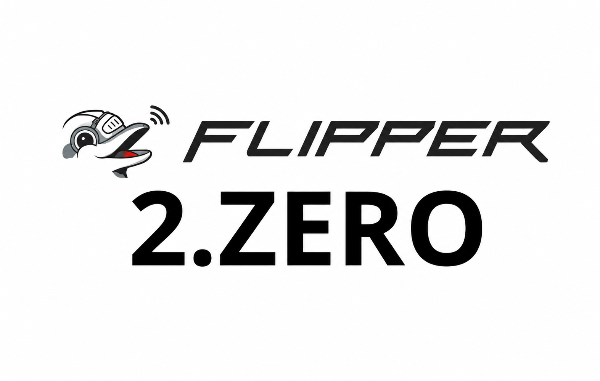
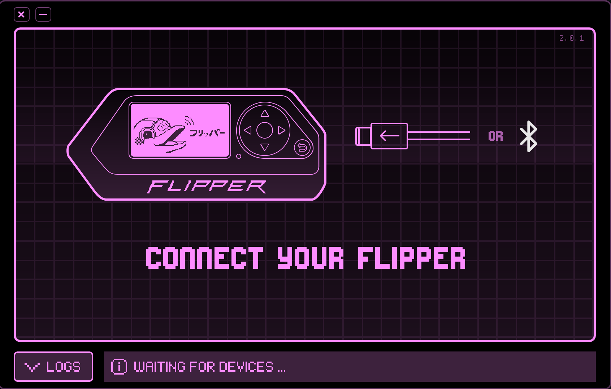
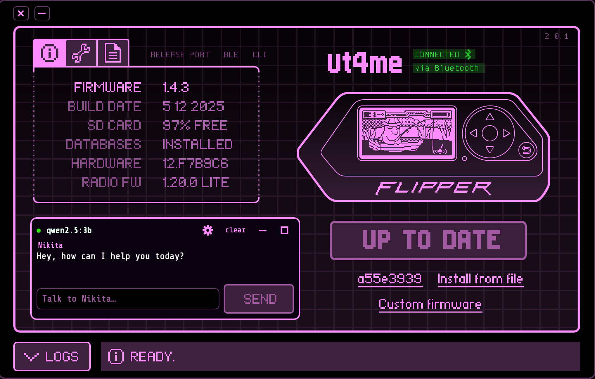
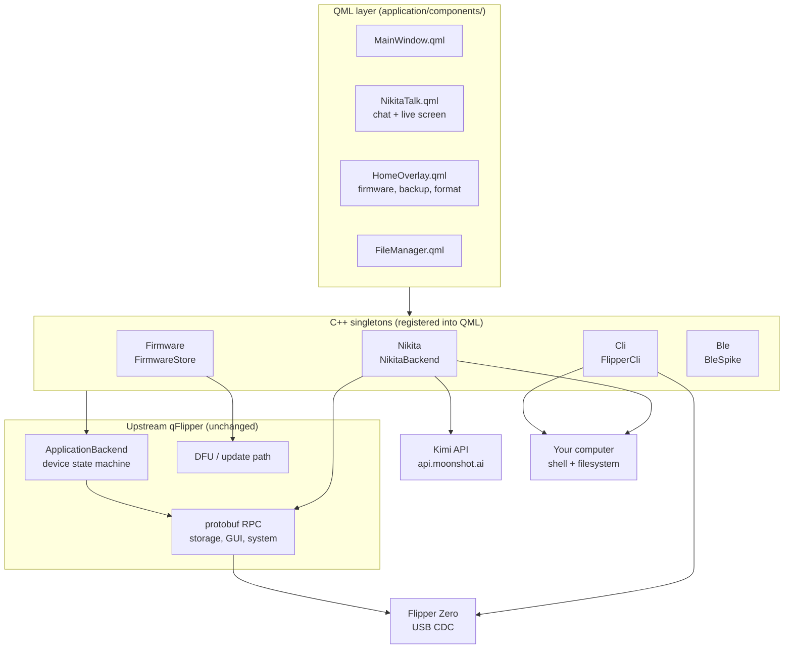

<p align="center">
  
</p>

# nikita-qflipper

An unofficial fork of [qFlipper](https://github.com/flipperdevices/qFlipper) — the desktop companion app for the [Flipper Zero](https://flipperzero.one) — that turns it into an agentic workstation for the device.

On top of everything upstream qFlipper does (firmware updates over DFU, screen streaming, device recovery), this fork adds five things that share the same link to the device:

| | What it is |
|---|---|
| **Nikita** | An LLM agent with tool-calling, running on the **Kimi API** (`kimi-k2.6` by default). Off until you enable it. It reads and writes the SD card, runs Flipper CLI commands, **sees and drives the device's screen** — and, within the access you grant it, carries out real work on your own computer: reading and writing files, running builds, driving shell commands. |
| **File manager** | Upstream lets you move files on and off the card. Here you also **edit them in place** — double-click opens an editor that saves straight back over RPC — **create** new files on the device, and select many at once for batch operations. |
| **CLI panel** | A unified shell where the same command name reaches either the Flipper or your computer, chosen by the path you give it. Transfers between the two are MD5-verified. |
| **Firmware store** | Six firmware sources (official and community) with release/dev channels, side by side, installed through qFlipper's existing update path. |
| **Bluetooth (BLE)** | Cable-free connect — scan, pair and run the same RPC session over Bluetooth Low Energy as an alternative to USB. |

The agent runs on the **Kimi API** — you supply an API key (or export `MOONSHOT_API_KEY`), and each turn is sent to Moonshot's servers. Nothing else leaves the computer except firmware downloads and whatever you explicitly ask the agent to fetch. Everything the agent *does* — the SD card, the CLI, the buttons, your files — happens locally on the link to the device and on your own machine.

> **Not affiliated with Flipper Devices.** "Flipper Zero" and "qFlipper" are their trademarks. This is an independent fork, licensed GPLv3 like the original.

---

## Recent changes

The most significant changes since the first cut, newest work first. Some sections further down still describe the earlier local-model design; where they conflict with this list, this list is current.

- **`run_ble` — the RPC loader over Bluetooth.** Since the Flipper does not carry its text CLI over BLE, the App RPC that *is* carried was wired end to end (new `AppStart`/`AppExit` request + operation classes, plugin encoding, `ProtobufSession::appStart/appExit`). `run_ble(open, "NFC")` opens an app in one deterministic RPC call — no D-pad, no screen-guessing — and `run_ble(close)` returns to the desktop. It **switches apps cleanly**: opening while another app is running first walks back to the desktop with `back` presses (App_Exit's async teardown was unreliable), *then* starts the new one. BLE-only, mirroring how `run_cli` is USB-only.
- **Installed apps open by their `.fap` path, not a guessed name.** Built-in apps (NFC, Infrared, …) open by name; anything under `/ext/apps/<Category>/` must be opened by its full `.fap` path (`App_Start` accepts a path and silently ignores a made-up display name). And **"scripts" is a folder** — `/ext/apps/Scripts` — not an app: it is listed, never opened as one.
- **BadUSB/HID payloads can't run over USB, and Nikita no longer crashes the Flipper trying.** One USB port, one mode at a time: qFlipper holds it as a serial port, a payload needs it as a keyboard, so they collide (`USB is locked` → forcing it hard-reboots the device). The agent now refuses over USB and tells you the real path — plug the Flipper's USB into the *target* machine and connect over **Bluetooth**, leaving the port free to type.
- **BadUSB keyboard-layout awareness.** Garbled payload output (`https://` typed as `httpsö--`, dropped characters) is a layout mismatch, not a broken script — BadUSB sends key *positions*, mapped by the target's layout. Nikita now diagnoses this and tells you to set the Flipper's Bad USB layout to match the target (e.g. pt-BR/ABNT2), and notes the required layout when it writes a script.
- **BLE auto-reconnect.** The Flipper you connect to over Bluetooth is remembered (its per-host UUID + name), and on the next launch — when no cable is present — the app silently scans and reconnects to *that* device, no panel, no picking. A cable, if present, still wins.
- **The computer-side tools were renamed `host_*` → `computer_*`** (`computer_run`, `computer_read`, …) so which machine a call touches is readable from the name alone; the two confirmation dialogs and their QML were renamed to match. Old `host_*` names from a proven move or an older conversation are translated on the fly, so nothing filed under the old name breaks.
- **Queued messages show as their own turns.** Typing while a turn runs used to queue the text invisibly (only in the "queued" strip) and then send all of it joined into one blob. Now each queued message is drawn as its own "you" bubble the instant it starts, and the queue is processed **one message per turn**.
- **Chat rendering fixes.** The copy button toggled `visible` on hover, reflowing the row and jerking the scroll — it is now fixed-width and fades via opacity. And the auto-scroll uses `positionViewAtEnd()` rather than a hand-set `contentY`, which had stranded the list in blank space (messages blanking out and flickering back on scroll).
- **An interrupted turn no longer poisons the next request.** Pressing STOP mid-round left an assistant `tool_calls` message with no matching tool results, which made the *next* API call fail (`must be followed by tool messages responding to each tool_call_id`). Every dangling call is now answered with a synthetic "interrupted" result at the wire boundary.
- **The agent's toolbox now follows the link it is on.** `run_cli` needs the serial port, so over Bluetooth it is not offered at all; `read_screen` and `press_button` take its place. Over USB the reverse holds — the CLI does everything deterministically, so the screen tools are withheld rather than left as a slower way to get the same job wrong. `ir_universal` moved to the USB side too: it read its code database over RPC (fine wirelessly) and then transmitted through the CLI, so on BLE it half-ran and died at the send.
- **`press_button` follows the link.** Over **USB** it is `ok` and `back` only — the CLI navigates deterministically, and up/down/left/right there was guesswork off a picture the model could not read (that is how "remote4" became Remote3). Over **BLE** there is no CLI, so the full D-pad returns, because it is the only cursor there is — with the discipline that one press is followed by a `read_screen` before the next.
- **Infrared, done by command.** Saved remotes are files: read `/ext/infrared/<Name>.ir`, take the block whose `name:` matches, and `ir tx <protocol> <address> <command>` — with the trailing `00` padding stripped, because `ir tx RCA 0F000000 54000000` is rejected and `ir tx RCA 0F 54` is not. The universal database is never read as a file (`tv.ir` alone is 170 KB); `ir universal list tv` prints the valid signal names, and the `ir_universal` tool sends them. Sending with a raw `ir universal <remote> <signal>` is still refused — a name outside that list reboots the Flipper — but **listing is now allowed**, which it needed to be, since the rule right beside it says never guess a signal name.
- **A turn can no longer die in silence.** A round that spends its whole output budget reasoning over the screen's block art and returns empty (`done_reason: "length"`) is retried with an instruction to stop analysing and make one call, twice, instead of ending the turn with three tool rows and no words. A turn that stalls no longer signs off with a sentence it said on the way in.
- **The API key is verified, not just stored.** One `GET /v1/models` decides it: the model badge, the input box and the ability to send at all hang off a key the API has *accepted*, so the panel no longer shows a live-looking assistant that fails on the first message. The pass is remembered as a hash of the key, never the key.
- **A cable plugged in while Bluetooth is live takes over, without dropping the wireless link.** Both devices stay registered, the home screen says *"Cable connected"*, and unplugging falls straight back to Bluetooth — no disconnect-and-reconnect. The connection glyph reads the device's own `isBle` rather than the BLE panel's session flag, which used to claim Bluetooth with the cable in hand.
- **BLE scan has two modes.** With no device connected the button reads **FIND FLIPPER** and hunts for Flippers; once connected it becomes **SCAN NETWORK** and sweeps every LE device in range, listing them in the log. Only an actual Flipper gets a chip you can press, so a neighbourhood sweep no longer fills the panel with unpressable `(unnamed)` buttons.
- **A memory-only request stays a memory-only request.** *"remember that remote4 is my tv remote"* used to inherit the full toolbox from the previous turn and go poking at the device; it is now handed the three memory tools and nothing else.
- **The CLI panel's host group is labelled `Computer`, not `Device`** — in this app "device" means the Flipper, so the old heading said the opposite of the line above it. `help` also names the pass-through commands that are **not installed** on your machine, instead of letting you find out from a spawn error.
- **Chat scrolling stopped fighting you.** Half the auto-scroll call sites ignored the "stick to bottom" flag — including the one that fires on every streamed token — so scrolling up during an answer hauled you back down several times a second. All of them now go through one guard, and the flag is decided from what you actually do rather than from every layout-driven `contentY` change.
- **The brain moved from a local model to the Kimi API.** Nikita no longer runs `qwen3:4b` under Ollama — it talks to Moonshot's Kimi over the OpenAI-compatible API. **`kimi-k2.6` is the default** (GA, the account's full rate limit, and it prompt-caches the stable prefix so repeated rounds are cheap); **`kimi-k3`** is selectable for the hardest jobs but is rate-limited in preview. The whole Ollama path — model catalog, pull/remove, runtime installer — was removed. The setup panel gained a **BRAIN** model picker and an **API-key field** with show/copy/save; the key is write-only to the UI (there is no getter), and the environment variable `MOONSHOT_API_KEY` overrides a stored key.
- **The cost, not the context window, is what the footer now shows** for an API turn — dollars per round and per turn, from the real token usage.
- **Seeing and driving the Flipper's screen.** `read_screen` reads the current framebuffer so the agent is no longer blind, and `press_button` hands the resulting screen back with every press. Navigation is CLI-first: `loader open <App>` reaches an app deterministically instead of counting D-pad steps, and blind button sequences are never stored as reusable "recipes" (they only reproduce from the exact screen they started on).
- **Universal remotes, done in code.** `ir_universal(remote, button)` reads `/ext/infrared/assets/<remote>.ir` and transmits every brand's code for that button over `ir tx` — the on-screen universal remote, without navigation. "Turn on/off the TV" (and its variants, in EN and pt-BR) is a **deterministic shortcut** that fires `ir_universal(tv, Power)` with no model round at all, because TV power is a toggle.
- **The Flipper can no longer be crashed from the CLI by the agent.** `ir universal …` crashes this firmware (NULL-pointer reboot), so it is refused before it reaches the device; and if any command does reboot the Flipper, the app detects the fault / dropped link and reports failure instead of claiming success.
- **Determinism over the model's word.** The BadUSB Apple-keyboard `ID` line is enforced in `sanitizeDuckyScript` regardless of what the model writes; the "claimed success without acting" guard now also catches "it's already at …"-style existence claims; and `{{LAST_RESULT}}` lets a saved file carry a command's real output instead of the model retyping a number.
- **Memory respects your edits.** Hand-editing `actions-memory.txt` (including clearing it) now sticks instead of being overwritten by the in-memory copy, and multi-step "recipes" record the whole chain with each step's target, not just the first file.
- **Erase means disconnect.** Wiping assistant data now also removes the API key and switches **every access filter off**; a re-opened chat starts with no access until you grant it.
- **macOS file access fixed.** `Info.plist` now carries the Desktop / Documents / Downloads / removable-volume usage-description keys. Without them a Developer-ID + hardened-runtime build is denied those folders outright (EPERM), which had read as "the Desktop is read-only."
- **The release build actually runs on other Macs.** `build_mac.sh` now bundles the Qt frameworks and QML plugins with `macdeployqt` and signs them bottom-up. The earlier notarized DMG launched only where Homebrew's Qt happened to sit and crashed everywhere else with "Library not loaded … different Team IDs."
- **UI.** Each tool line in the chat is a clickable row that expands to the exact call (`ir_universal(remote=tv, button=Power)`); the live progress line (elapsed · tokens · cost · status) sits under the answer and stays in view; and the send control is **Stop** during a turn, with **Send** appearing only when you start typing something to queue.

---

## Screenshots

<table>
<tr>
<td width="50%" align="center">
<br>
<sub><b>Two ways in.</b> No Flipper connected yet — plug in over USB, or hit the Bluetooth icon next to the cable to scan and connect wirelessly instead.</sub>
</td>
<td width="50%" align="center">
<br>
<sub><b>Connected — over Bluetooth.</b> Live device info, the Flipper's own screen mirrored in real time, firmware status, and Nikita ready to help, no cable involved.</sub>
</td>
</tr>
</table>

---

## Compared to upstream qFlipper

| | Upstream qFlipper | nikita-qflipper |
|---|---|---|
| **Firmware sources** | Official only | Official plus five community firmwares — Momentum, Unleashed, RogueMaster, ARF, Xero — listed side by side, each with its own release/dev channel |
| **Editing a file on the device** | Not possible. Download it, edit it locally, upload it back | Double-click it in the file manager. An editor opens in-app and Save writes straight back over RPC |
| **Creating a file** | Folders only | **New File**, created directly on the card |
| **Selecting files** | One at a time | Multi-select — modifier-click, rubber-band drag, select-all — with batch delete that names the count in the confirmation |
| **Backup / restore** | The internal storage (`/int`): settings and pairing data | The whole SD card, with live progress and `.tgz` packing. Upstream's `/int` tarball could never bring back a capture or a script |
| **Connecting to the device** | USB only | USB, or scan-and-connect over Bluetooth Low Energy — same RPC session either way |
| **Shell access** | None | A CLI panel that reaches the Flipper *and* your computer, with MD5-verified transfers between them |
| **AI assistant** | None | Nikita: an LLM agent on the Kimi API (`kimi-k2.6`), tool-calling, with a key you paste into setup. Off until you switch it on, and erasable in one click |
| **What the assistant may touch** | — | Nine access switches, per group, enforced at execution — not just hidden from the model |
| **Work on your own computer** | None | Opt-in agent mode — read/write files, run builds and shell commands, with the results fed back into the conversation |
| **App self-update** | Enabled, pointed at Flipper Devices' server | Disabled on purpose — see [why](#why-the-app-self-updater-is-off) |

Everything upstream already does — DFU firmware installs, screen streaming, device info, recovery/repair — is untouched and still works the same way.

---

## How it fits together

qFlipper already owns the hard part: a USB CDC serial link to the device, a protobuf/RPC layer on top of it, and a state machine that tracks whether the Flipper is connected, streaming, updating, or in DFU. This fork does not replace any of that — it adds consumers of it.



The four singletons are registered in `application/application.cpp` as `Nikita`, `Firmware`, `Cli` and `Ble`, and are reachable from any QML file via `import QFlipper 1.0`.

---

## Nikita — the agent

### The loop

A turn is: build the prompt → send to the Kimi API → if the model asked for tools, run them and feed the results back → repeat until it answers in prose.

- **Endpoint:** `POST https://api.moonshot.ai/v1/chat/completions` (OpenAI-compatible), one reply parsed whole — not streamed, so a tool call can never arrive half-built.
- **Window:** Kimi holds 256K tokens and prompt-caches the stable prefix, so the system prompt (~8k tokens) is re-sent every round but billed as a cache hit, and the conversation budget is large enough that a multi-round turn keeps its own context instead of being trimmed mid-task.
- **No step cap.** A job that genuinely needs forty tool calls gets forty. What is bounded instead is *going in circles*: three consecutive rounds that produce no new call ends the turn, with a far-off ceiling as a runaway stop.

### The tool surface

Tools are assembled per turn, not fixed. Tool **count** is the single biggest lever on whether a small model calls anything at all — at 22 entries a 3B model stopped calling tools entirely and just described the work in prose. So the list is pruned to what the message is actually about.

**Always offered — memory:**
`remember` · `list_memory` · `forget`

**The Flipper** (dropped when the message is plainly about the computer):

| Tool | Does |
|---|---|
| `list_files` | List a path on the device (`/ext` is the SD root, `/int` internal) |
| `read_file` | Read a device file, up to ~8 KB |
| `save_file` | Write a file to the SD card |
| `make_dir` / `delete_file` / `rename_file` / `file_info` | The rest of the storage verbs |
| `read_screen` | Read the current screen (the framebuffer) as text — **BLE only** |
| `press_button` | Tap a button and get the resulting screen back. **USB:** `ok`/`back` only. **BLE:** full D-pad (`up`/`down`/`left`/`right`/`ok`/`back`), since there is no CLI to navigate with |
| `run_cli` | Any Flipper CLI command: `device_info`, `subghz`, `nfc`, `gpio`, `ir`, `led`, `vibro`, `power`, `js`, … — **USB only** (sending with `ir universal` is refused; `ir universal list` is allowed) |
| `run_ble` | Open or close an app by name (or `.fap` path) over RPC — the deterministic way to navigate on a wireless link — **BLE only** |
| `ir_universal` | Fire a universal remote button (`tv`/`ac`/`audio`/`projector` × `Power`/`Mute`/…) — reads the `.ir` asset and transmits every brand's code over `ir tx` — **USB only**, because the transmit goes through the CLI |

The last four are **split by transport**: a turn over USB is offered `run_cli` and `ir_universal`; a turn over Bluetooth is offered `read_screen` and `press_button` instead. A tool that cannot work on the current link is never put on the table, so the model cannot pick it and half-run it.

**Your computer** — only offered when agent mode is on. This is the part with no equivalent upstream: Nikita stops being a chat window about the Flipper and becomes something that does work on your machine.

| Tool | Does |
|---|---|
| `computer_read` / `computer_write` | Read and overwrite text files anywhere you can |
| `computer_run` | Run a shell command and get back the exit code plus combined stdout/stderr |
| `computer_cd` | Move around, and report where it is and what is there |
| `computer_list` / `computer_find` | Browse and search the filesystem |
| `computer_mkdir` / `computer_move` / `computer_copy` / `computer_delete` | The rest of the file verbs |

In practice that means asking for the outcome instead of the steps: *"read the crash log on my Desktop and tell me what broke"*, *"build this project and fix the first error"*, *"pull every `.sub` off the card into a folder in Documents, grouped by frequency."* It runs the commands, reads the real output, and reports what actually happened rather than what it intended.

`computer_cd` is stateful: the agent walks a working directory the way a person at a shell does, and `computer_run` starts wherever it last landed — so a task can move somewhere and stay there across a dozen calls. Paths accept `~`, and well-known folder names ("Desktop", "Downloads", and their pt-BR spellings) resolve through `QStandardPaths` rather than being hardcoded, so they land in the right place on a localised install or a relocated home.

The two machines never blur together: the Flipper tools and the host tools are separate families with separate names, and a call aimed at the wrong one is rerouted rather than silently run in the wrong place.

### Not lying about what it did

A local 7B model will cheerfully report a file it never wrote. Most of the agent code is about making that impossible rather than unlikely:

- **Writes are read back.** `computer_write` checks the file's size on disk against what it meant to write, and reports `verified: true/false` — the return value of `QFile::write` is not evidence.
- **Deletes distinguish "gone" from "was never there."** A delete of a missing file returns `deleted: false, existed: false` with an explicit instruction not to claim a deletion. Recursive removes are re-checked on disk afterwards, because `removeRecursively()` can return false having emptied most of a folder.
- **Claimed-but-unrun actions are caught.** The final text is scanned for claims ("saved to…", "created…") that no tool call backs up; when one is found the turn is sent back for correction, up to six times.
- **Destructive paths are refused.** Deleting `/`, a home directory, or anything at depth ≤ 1 is rejected with a message asking for something inside it instead.

### Memory

Two files, and they are **not** the same thing.

`memory.txt` holds everything Nikita learns about **you** — who you are and how you work, the machine and tools you use, what you are building and why, opinions and preferences, things you explain, decisions and the reason behind them. Not a log of tasks.

`actions-memory.txt` holds what it has **done**: which tool actually solved which kind of request, recorded only after the artifact was confirmed on disk. Read back into the prompt it reads as a sentence, not a stack trace — *"When asked to 'create rel2.txt in Desktop', I created rel2.txt and saved it to Desktop"* — because a small model copies the shape of what it reads.

Both live in `/ext/nikita` on the Flipper so they travel with the device, mirrored to a local cache so the agent still knows you when it is unplugged.

**Remembering is automatic.** You will almost never say "remember this" — you will just mention something. Nikita calls `remember()` silently in the same turn and carries on with what you actually asked. There is **no cap** on facts: the old build kept the most recent 40, which meant it quietly forgot the oldest thing it knew about you every time it learned a new one.

If you tell Nikita an action didn't work, the lesson is unlearned **and** the correction is written to `mistakes.txt`, which is read back on every turn as *"you were asked X, you did Y, that was wrong — do not repeat it"*. Forgetting a bad lesson stops it being recommended; nothing else stops the model reaching the same wrong conclusion again.

### Feedback — a second opinion, never a gate

After an action, a strip appears: **Did that do what you asked?** with `YES` / `NO` and an optional box to say what went wrong.

It opens **after** the turn has already closed and the lesson has already been filed automatically. Ignoring it, clearing the chat or quitting changes nothing — silence is not a verdict. It only ever adds.

The optional note is the valuable half: *"I asked it to open Chrome and it made a txt file"* is something no automatic check can produce. The tool reported success, the file exists, and the request was still not met. Only the person who asked can tell the difference.

### While it is thinking

A local 4B takes minutes, so the window says what is happening rather than sitting still:

```
●  1m 53s · 2.1k tokens · writing the file...
· wrote /Users/you/Desktop/note.txt (17 bytes)
· done in 2m 11s · 4.5k tokens
```

Every phrase is set at a real transition — `thinking`, `getting to work`, `writing the file`, `running the command`, `wrapping up` — never a decorative cycle. Tokens are prompt plus generated, summed across every round the turn takes.

The input **stays editable** while a turn runs. Anything typed is queued, shown as `↳ queued (1): …` with a `cancel`, and delivered as one message the moment the turn ends. The send button becomes `Queue` when there is text and `Stop` when there is not: while a turn runs, stopping is almost certainly not what that text was for.

### The model — the Kimi API

Nikita runs on **Moonshot's Kimi API** over the OpenAI-compatible wire format. Pick the model in the **BRAIN** section of setup:

| Model | Notes |
|---|---|
| `kimi-k2.6` | **Default.** GA, runs at the account's full rate limit, and prompt-caches the stable prefix so repeated rounds of a turn are cheap. Best for tool-heavy work. |
| `kimi-k2.7-code-highspeed` | Fast, coding-tuned. |
| `kimi-k3` | Newest, 1M-token context — reserve it for the hardest jobs; in preview it carries its own tighter rate limit than the account tier. |

You supply the key: paste it into the field under **BRAIN** (write-only to the UI — there is no getter, and clicking the field opens it for editing with the key masked), or export `MOONSHOT_API_KEY` before launching, which overrides a stored key. **Erase** removes the stored key.

This replaced an earlier local design that ran a single `qwen3:4b` under Ollama, with a whole model manager to pull and remove it. That path — and the 8 GB / 8192-context arithmetic that came with running a 4B on an M1 — is gone. Two consequences worth knowing:

- Sampling is per model family: `kimi-k3` is a reasoning model that fixes its own `temperature` (sending one gets *"only 1 is allowed for this model"*), so the API request sends none.
- The conversation window is bounded by a large token budget (Kimi holds 256K and caches the growing prefix), so a multi-round navigation turn keeps its own context instead of being trimmed mid-task; a stale `read_screen` framebuffer collapses to a one-line placeholder so screenshots of menus long gone don't pile up.

### Access filters — what it is allowed to touch

Under the model in the same panel, nine switches decide what Nikita can reach. `NO ACCESS` and `FULL ACCESS` are shortcuts for all of them at once; anything in between reads as `custom`.

| Group | Tools |
|---|---|
| Memory | `remember` `list_memory` `forget` |
| Flipper: read | `list_files` `read_file` `file_info` |
| Flipper: create and change | `save_file` `make_dir` `rename_file` |
| Flipper: delete | `delete_file` |
| Flipper: control | `press_button` `run_cli` `read_screen` `ir_universal` |
| Computer: read | `computer_list` `computer_read` `computer_find` `computer_cd` |
| Computer: create and change | `computer_write` `computer_mkdir` `computer_move` `computer_copy` |
| Computer: delete | `computer_delete` |
| Computer: run commands | `computer_run` |

A disabled group is not merely hidden from the model — the call is refused at execution time as well. Hiding a tool from the list is a smaller menu, not a gate: a small model invents tool names, and an older conversation still in history carries calls from when the access was allowed.

The state is stored as the set that is **off**, so a group added in a later version arrives switched on rather than appearing disabled without anyone having disabled it.

### Personality

Five presets — Default (Nikita), Chill helper, Chaos gremlin, Deadpan pro, Sweet companion — or "build one from the name." The default is terse and low-key: short answers, no emoji, no mascot voice. The choice is persisted in `QSettings` and layered over the built-in system prompt.

---

## Off by default

A fresh install opens with Nikita **switched off**. The chat is replaced by a single control:

```
        (  ●    )
      ENABLE NIKITA
```

Plenty of people want a Flipper companion without any AI in it, and an assistant that reads files and keeps notes about you should be something you switch on — not something you discover already running. Off is not cosmetic: with the switch off the assistant cannot start a turn, and nothing touches `/ext/nikita` on the card. Five separate code paths used to write there on startup; all five now refuse.

**Turning it on** asks first, and says what starts happening: conversations kept on this computer, facts saved here and on the SD card, which actions worked, and files read or changed once you allow that in ACCESS. Nothing is sent anywhere — the model runs locally.

**Turning it off** warns that it erases everything Nikita stored about you, and then does it: the conversation, the facts, the learned actions, the permissions you granted it, the local files, and the whole `/ext/nikita` folder on the card — the folder itself, not just its contents, because an empty folder left behind reads as "something is still installed".

Both dialogs have Cancel and a confirm, and expand to full size if the text does not fit.

## Agent mode: read this before turning it on

Agent mode is **off by default** and gated behind an explicit opt-in in the setup wizard, with a warning. Here is the same warning at more length, because it matters:

**With agent mode on, a local language model can run arbitrary shell commands as you, and read, overwrite or delete any file you can.** The workspace folder you pick is *where it starts*, not a fence around it — `computer_run` takes a full command line, so a boundary on the typed tools was never real, and pretending otherwise only pushed the model off tools that report failures honestly and onto `sh -c`, where mistakes are invisible.

Concretely:

- `computer_run` executes via `/bin/sh -c` (or `cmd /c` on Windows), with a 15-minute timeout and captured output. There is no allowlist and no per-command confirmation.
- `computer_write` and `computer_delete` reach anywhere on the filesystem, minus the root/home guards described above.
- The agent reads files off your SD card and can download URLs. **That content enters the model's context.** A text file planted on a Flipper you didn't prepare yourself is a plausible prompt-injection vector.

Sensible use: keep the workspace under version control, leave agent mode off for day-to-day device work, and turn it on deliberately for a session where you want it. Per-action confirmation is on the roadmap below and is not implemented yet.

Without agent mode, Nikita still has the full device tool set — the SD card, the Flipper CLI, and the buttons. It just has no reach onto your computer.

---

## The CLI panel

A terminal that speaks to **two machines at once**, and is explicit about which one it means.

Most commands exist in three spellings:

```
ls  /ext/nfc      # a Flipper path -> runs on the Flipper
ls  ~/Downloads   # a host path    -> runs here
fls /ext/nfc      # the f-prefix always means the Flipper
```

Commands that route by path: `ls` `cat` `stat` `du` `wc` `grep` `head` `tail` `find` `diff` `mkdir` `touch` `rm` `mv` `file`.

Flipper-only: `fopen` (launch an app) · `fclose` · `freboot` · `fshutdown` · `fvibro` · `flocate` · `fdf` · **`fname <2-8 letters/numbers>`** — sets the Flipper's custom device name (same file, `/ext/dolphin/name.settings`, that Settings → Desktop → Change Flipper Name writes on the device itself) and reboots to apply it; `fname reset` goes back to the factory name.

Host-only, with a real explanation when you reach for the wrong machine — `ping`, `ifconfig`, `apt`, `ps`, `kill`, `mount`, `lsblk`, `uname`, `sudo`, `pm3` (Proxmark3), plus pass-through for `git`, `docker`, `ssh`, `nmap`, `openssl`, `tar` and friends. Asking the Flipper to `ping` doesn't fail silently; it tells you the Flipper has no network.

- **`python3 [script] [args...]`** — runs Python on this computer (the Flipper has none of its own). Point it at a device path — `python3 /ext/scripts/thing.py` — and it fetches the script off the SD card first and runs *that*, so a script you save on the card behaves the same on whatever computer the Flipper is plugged into next. A host path or a bare filename still just runs locally, same as any terminal.
- **`flipper install <url to a .fap> [Category/name.fap]`** — downloads a `.fap` and installs it straight to `/ext/apps`, the same 1 MB cap `wget` has. Files in `/ext/apps` only show up in the on-device app menu when they're filed under a category folder (`Tools`, `NFC`, `Games`, ...), so this defaults to `Tools` unless you say otherwise.

Commands that straddle both by design:

- **`cp [-r] <src> <dst>`** — copies in either direction, including host ↔ device, with wildcards. **Every transfer is MD5-verified.**
- **`wget <url> [dest]`** — downloads on the computer and writes the result straight onto the Flipper, which has no network of its own.
- **`edit <file>`** — opens an editor panel, for device files and host files alike.

`help` groups commands as **Flipper** (the `f`-prefixed set), **Computer** (everything that runs here), and **Firmware** (the connected Flipper's own command set). The pass-through commands are forwarded to a program of the same name on this machine, so *listed* and *works* are two different things — `help` names the ones that are not installed:

```
  (not installed on this computer: docker ifdown ifup nmap)
```

Plus the shell affordances you expect: Tab completion (host and device paths), `history` with `!12` and `!!`, `colors on|off`, and `verbose on|off` for a wire-level log of everything a command actually sends.

`tgz <folder>` packs a folder the same way Backup does.

A command the panel doesn't recognize is sent to the Flipper as-is, so the firmware's own CLI is always reachable underneath — including commands the firmware itself drops you into a nested prompt for (`nfc`, `subghz`'s `chat`, `subshell_demo`...). Type `exit` to leave one, or just close and reopen the panel.

**Reconnects on its own after anything that reboots the device** — `freboot`, `fname`, a factory reset done from the Flipper's own menu, an update. The panel used to go dead until closed and reopened; now it waits for the same physical Flipper to reappear (under whatever port it comes back on, which a rename changes) and picks the session back up.

---

## File manager

Upstream's file manager is a transfer window: browse the card, drag files on, download them off, rename, delete, make a folder. This fork keeps all of that and makes the card something you can actually *work in*.

**Edit files in place.** Double-click any file and an editor opens inside the app, holding the file's real contents read over RPC. Save writes it straight back to the same path — no extension forcing, no download-edit-reupload round trip. Editing a `.txt` BadUSB script, a `.sub` capture's metadata or an app's config is now a two-click operation.

It is deliberately **one editor, shared**. The CLI panel's `edit <path>` opens the same panel, and the panel records which side opened it so Save routes back to the right backend. Two editors would eventually have looked and behaved differently; one cannot.

**Create files on the device.** A **New File** action makes a file directly on the card, so you can start a BadUSB script or a config from the app instead of creating it on your computer and copying it across.

**Work on several files at once.** Selection is a real selection: modifier-click to add, drag a rubber band across the list, or select all. Delete then acts on the whole set, and the confirmation tells you how many items it is about to remove rather than naming just one. Navigating to another folder clears the selection, so a stale pick from a previous directory can never be acted on by mistake.

Drag-and-drop upload from your desktop works as before, and the view refreshes itself after the agent or the editor writes to the card, so what is on screen is what is on the device.

---

## Firmware store

Upstream qFlipper installs the official firmware. This fork installs **Nikita** by default and lists seven sources side by side, installing any of them through the same DFU/update path:

| Source | Channels | |
|---|---|---|
| **Nikita** | release, rc, dev | This ecosystem's own firmware — the default |
| **Official** | release | Flipper Devices' own build |
| **Momentum** | release | Feature-rich community firmware |
| **Unleashed** | release, dev | Popular community firmware |
| **RogueMaster** | release, dev | Feature-packed community firmware |
| **ARF** | dev | Automotive / Sub-GHz research |
| **Xero** | release | Lightweight, based on the official one |

Nikita, Official and Momentum are read from a `directory.json` update server; the rest from GitHub releases. Details worth knowing:

- **Nikita is the main update path, not just a row in this panel.** The app's own update check points at Nikita's feed, so the home screen offers Nikita builds; every other firmware here is one click away, which is what makes going to Official an *import* rather than the default.
- Nikita's feed is served out of the firmware repo itself (`raw.githubusercontent.com/andresnalegre/Nikita-V8/.../firmware/directory.json`), regenerated by its release workflow. There is no update server to keep alive.
- **Which firmware is running is asked, not guessed.** `device_info`'s `firmware_origin_fork` names it outright. The version string cannot: Nikita reports `v8` for a local build and `nkt-001` for a release, and guessing from that used to read a Nikita device as *Official* — the one answer it can never be. Version shapes remain the fallback for firmwares that don't report a distinguishable origin (Xero reports `Official`).
- **Forked versions can be compared at all now.** `nkt-001`, `mntm-012` and `unlshd-084` all put a name where upstream's parser expected a number, so it gave up and every fork version compared *equal* to every other — an update could never be offered on any of them, because "newer" could not be expressed.

- Your channel choice is remembered **per source**.
- Payloads are cached, so switching channels doesn't re-fetch.
- What was learned last run is loaded at startup, so the panel shows correct versions before — and regardless of — what the network says this time.
- The GitHub sources share the unauthenticated **60-requests-per-hour** budget for your whole machine, and four are checked per refresh, so refreshes are throttled rather than fired on every panel open.

The channel a firmware was actually flashed from is recorded, so the app can tell "an update exists" apart from "you are on a different firmware than you were."

---

## Other device operations

Exposed in the home overlay, each behind a confirmation dialog:

- **Backup SD card** — walks the card and copies everything to your computer with live progress, packing it into a `.tgz`. This replaced upstream's Backup, which saved the *internal* storage (`/int`): that is settings and pairing data, so it could never bring back a capture, a script or an app's data.
- **Restore SD card** — from a `.tgz` or from a plain backup folder, so archives from either generation still restore.
- **Format SD card**
- **Reboot device**

The chat panel also carries a **live mirror of the Flipper's 128×64 screen**, driven by qFlipper's existing screen streaming — useful when the agent is navigating menus with `press_button`, since it is otherwise pressing blind.

---

## Bluetooth

Connect without the cable: a `BleTransport` implements the same `FlipperTransport` interface the USB link uses, so the RPC session on top — storage, device info, the live screen mirror — doesn't know or care which one it's running over. It's behind the `HZUI_BLE` compile flag, enabled on **Windows, Linux, and macOS**, each on Qt Bluetooth's native backend for that platform (WinRT, BlueZ/D-Bus, CoreBluetooth via Homebrew's `qtconnectivity`).

**Getting there:** the "no device" screen shows the USB cable and, right beside it, a Bluetooth icon (see the [screenshots](#screenshots) above) — click it to open the scan/connect panel. A found Flipper is identified by its GATT serial service UUID, not by name, so a device renamed away from the factory default still shows up correctly.

A few things worth knowing:

- **The CLI panel is still USB-only.** It talks to the device's raw USB serial port directly, which has no BLE equivalent — opening it over a Bluetooth session shows *"CLI is USB only."* instead of a blank terminal. Everything else (storage, file editing, device info, the screen mirror, firmware operations) works the same over either transport.
- **That limit shapes the agent's toolbox too.** Over Bluetooth, files and the screen are the surface: `run_cli` and `ir_universal` are withheld, and `read_screen` / `press_button` (full D-pad) are offered in their place — plus **`run_ble`**, which opens and closes apps over the App RPC so navigation is a single deterministic call rather than button-walking. Anything else CLI-backed — IR `tx`, `gpio`, `subghz`, `nfc`, `rfid`, `led`, `vibro`, `power` — still needs the cable, and the agent says so rather than hunting for a way round it.
- **The last-used Flipper is remembered and reconnected automatically.** Connect over BLE once and the device (its per-host UUID + name) is saved; the next launch reconnects to it on its own when no cable is present. `forgetSaved()` clears it.
- **Plugging the cable in while Bluetooth is live is not a disconnect.** The USB device takes over as the active one, the wireless device stays registered, the home screen says *"Cable connected — Bluetooth still linked"*, and unplugging falls straight back to Bluetooth.
- **Scanning has two modes.** **FIND FLIPPER** (no device connected) filters to Flippers by GATT service UUID; **SCAN NETWORK** (once connected) lists every LE device in range in the log. Only a Flipper is offered as a connectable chip.
- **A stuck connection times out and fails cleanly**, rather than hanging forever. macOS in particular can hold onto a stale CoreBluetooth-side connection record from an earlier session, which otherwise leaves `connectToDevice()` with no callback ever firing — no error, no spinner giving up on its own. If a connection attempt does time out repeatedly, macOS's Bluetooth Settings → *Forget This Device* clears it.
- On macOS, the app's `Info.plist` carries `NSBluetoothAlwaysUsageDescription` — required for CoreBluetooth to scan or connect at all; without it the OS silently denies access with no dialog explaining why.

---

## Why the app self-updater is off

The comparison table above is all additions bar one. This is the removal, and it is deliberate.

**The application self-updater is disabled** (`DISABLE_APPLICATION_UPDATES` in `qflipper_common.pri`). Upstream's updater points at Flipper Devices' own server, so leaving it on would let a user "update" straight into vanilla qFlipper — silently uninstalling this fork. Flipper *firmware* updates use a separate registry and are unaffected. Re-enabling it means dropping the define **and** pointing `applicationupdateregistry` at a feed of this fork's own releases.

The base project structure is otherwise unchanged from [upstream](https://github.com/flipperdevices/qFlipper#project-structure).

---

## Requirements

**Runtime**

- A Flipper Zero — a USB cable that carries data, or Bluetooth on a build with `HZUI_BLE` enabled (the CLI panel still needs the cable; see [Bluetooth](#bluetooth)).
- A Kimi API key (from [platform.kimi.ai](https://platform.kimi.ai)) — pasted into setup or exported as `MOONSHOT_API_KEY`. Turns cost a cent or two each; the account needs a little balance.
- Network access to `api.moonshot.ai` while the assistant is in use.
- Nikita is optional: without a key the app is still a working qFlipper with the CLI panel and firmware store.

**Build** — Qt **6.4.2** or newer (builds on 6.7 / 6.8), modules `qtserialport`, `qt5compat`, `qtsvg`, `qtimageformats`, `qtconnectivity`, plus libusb-1.0 and zlib.

---

## Build

A plain `git clone` is enough — `nanopb` and `libwdi` are vendored in the tree, not fetched as submodules.

### Linux

```bash
sudo apt update && sudo apt install -y \
    build-essential git \
    qt6-base-dev qt6-base-dev-tools qt6-declarative-dev \
    qt6-serialport-dev qt6-5compat-dev qt6-svg-dev qt6-connectivity-dev \
    libgl1-mesa-dev libusb-1.0-0-dev zlib1g-dev

git clone https://github.com/andresnalegre/nikita-qflipper
cd nikita-qflipper
mkdir build && cd build
qmake6 ../qFlipper.pro CONFIG+=qtquickcompiler
make -j"$(nproc)"
```

Binary: `build/application/qFlipper`.

`qt6-5compat-dev`, `qt6-svg-dev` and `qt6-connectivity-dev` are the easy ones to miss — qmake fails with `Unknown module(s) in QT: ...` if any is absent.

**USB permissions:**

```bash
sudo cp installer-assets/*.rules /etc/udev/rules.d/ && sudo udevadm control --reload
```

**AppImage:** `./build_linux.sh`, which needs `linuxdeploy` and `linuxdeploy-plugin-qt` on `PATH`. The reproducible way is the provided container:

```bash
docker build -t nikita-build docker/
docker run --rm --privileged -v "$(pwd)":/project nikita-build /project/build_linux.sh
```

### Windows

Needs Qt 6.4.2 `msvc2019_64`, MSVC 2019 build tools, and [`jom`](https://wiki.qt.io/Jom). Install Qt with [`aqt`](https://github.com/miurahr/aqtinstall), modules `qtdeclarative qttools qtserialport qt5compat qtmultimedia qtspeech qtimageformats svg`.

> Keep Qt on a **different drive** than the source. A qmake quirk makes it generate broken relative paths otherwise, and the build dies in `dfu`.

```bat
git clone https://github.com/andresnalegre/nikita-qflipper
cd nikita-qflipper
:: optional overrides:  set QT_DIR=...   set VS_VCVARS=...   set JOM=...
build_windows_dev.bat
```

Output: `build\qFlipper.exe`. On first run, stage Qt's DLLs and plugins next to it:

```bat
"%QT_DIR%\bin\windeployqt.exe" --qmldir application build\qFlipper.exe
```

After that, `build_windows_dev_inc.bat` is the fast incremental build for code and QML changes. (`build_windows.bat` is the separate full release build -- installer, code signing, the works -- and predates this fork; see the comment at its top.)

### macOS

```bash
./build_mac.sh
```

Builds for the host architecture only — the project-compiled nanopb dependency has no x86_64 slice on Apple Silicon, so a forced universal build fails to link. Override with `BUILD_ARCHS="x86_64 arm64" ./build_mac.sh` if you have universal dependencies.

The script bundles the Qt frameworks and QML plugins with `macdeployqt` so the `.app` runs on a Mac without Homebrew's Qt. `RELEASE=1 ./build_mac.sh` additionally signs everything bottom-up with a Developer ID, notarizes, staples, and produces a signed, notarized `qFlipper.dmg` — it needs a Developer ID in the keychain and a `notarytool` profile named `nikita`.

---

## First run

1. Launch the app. Nikita is **off** — you get the Flipper side of qFlipper and nothing else. If that is all you wanted, you are done.
2. To use the assistant, click **ENABLE NIKITA** and read what it tells you before confirming.
3. Open setup (gear icon) and, under **BRAIN**, pick a model (`kimi-k2.6` by default) and paste your Kimi API key — or export `MOONSHOT_API_KEY` before launching.
4. In the same panel set **ACCESS**: what Nikita may read, change, delete or run, on the Flipper and on this computer. Everything is on by default once enabled; `NO ACCESS` turns it all off in one click.
5. **Agent mode** is separate and off by default — if you turn it on, pick the workspace folder it should start in. Read the section above first.

---

## Project layout

```
application/
  nikitabackend.{h,cpp}      NikitaBackend, FirmwareStore, FlipperCli
  application.cpp            registers the QML singletons
  blespike.cpp               BLE scan/connect panel
  bletransport.cpp           BLE FlipperTransport implementation
  components/
    NikitaTalk.qml           chat panel + live Flipper screen
    MainWindow.qml           shell, setup wizard, file editor, CLI and BLE overlays
    HomeOverlay.qml          firmware store, backup/restore/format
    FileManager.qml          card browser: new file, multi-select, drag-drop
    FileManagerDelegate.qml  per-row actions, batch delete, open-to-edit
backend/                     upstream: device state machine, RPC, operations
dfu/                         upstream: DFU/update transport
docker/                      Linux build image (Qt 6.4.2 via aqtinstall)
```

Everything outside `application/` is upstream qFlipper.

---

## Known limitations

Stated plainly, because they are the honest state of the tree:

- **`nikitabackend.cpp` is ~12k lines** and holds three unrelated classes. A split into three translation units is the next structural change.
- **No automated tests.** The pure functions worth covering first are path resolution, the tool-call parser, and the claimed-but-unrun detector. Two bugs found by hand would have been caught by any of them: a learning check that compared the raw argument path instead of the resolved one, so every relative-path write was judged a failure; and a de-duplication that recorded its state but never read it, so the same write went over USB on every cycle.
- **A turn takes minutes on a 4B.** Roughly 60–120 s for a simple action on an M1 with 8 GB, and 100 % of that is the model — the tool itself executes in milliseconds. The largest single win available is a non-reasoning model; the largest one already taken was fitting the context in RAM.
- **The Flipper's name cannot be changed on Official firmware.** `hardware_name` comes from the factory OTP block, read-only, and Official reads no `name.settings` from anywhere. The `name` command detects this and refuses instead of rebooting your device for nothing. Custom firmware (Momentum, Unleashed, RogueMaster) supports it.
- **Erasing the SD-card half is best effort.** With no Flipper attached, the local data is erased anyway and the two files on the card are not — they are recreated from scratch when the assistant is next enabled.
- **GPIO is USB-only, and that is a gap rather than a hard limit.** Pins are reached through `run_cli`, which needs the serial port, so there is no GPIO over Bluetooth. The firmware exposes it over RPC and the protobuf messages are compiled into the plugin (`gpio.pb.c`, the same eight pins: `PC0 PC1 PC3 PB2 PB3 PA4 PA6 PA7`) — nothing consumes them yet. The App RPC (open/close an app) was wired this way for `run_ble`, so GPIO is the same shape of work in the same layer as `storageRead`: a request/response pair, an operation, and a `ProtobufSession` method.
- **CI builds the Linux AppImage only, and only on release.** Nothing compiles on push, and Windows/macOS aren't covered at all.

---

## Credits

- **[lotei-qflipper](https://github.com/DUNKINKKD/lotei-qflipper)** — by [DUNKINKKD](https://github.com/DUNKINKKD). The visual language of this fork comes from Lotei, and Lotei is what made me want to build this architecture in the first place. The look, the terminal feel, the idea that a Flipper companion could have a character instead of a settings panel — that starting point is theirs.
- **[qFlipper](https://github.com/flipperdevices/qFlipper)** — Flipper Devices, the base this forks.
- **[Kimi / Moonshot AI](https://platform.kimi.ai)** — the model behind the agent (`kimi-k2.6` by default).
- Firmware sources: Flipper Devices, [Momentum](https://momentum-fw.dev), [Unleashed](https://github.com/DarkFlippers/unleashed-firmware), [RogueMaster](https://github.com/RogueMaster/flipperzero-firmware-wPlugins), [ARF](https://github.com/D4C1-Labs/Flipper-ARF), [Xero](https://github.com/noproto/xero-firmware).

## License

**GPLv3**, inherited from qFlipper — see [LICENSE](LICENSE).
